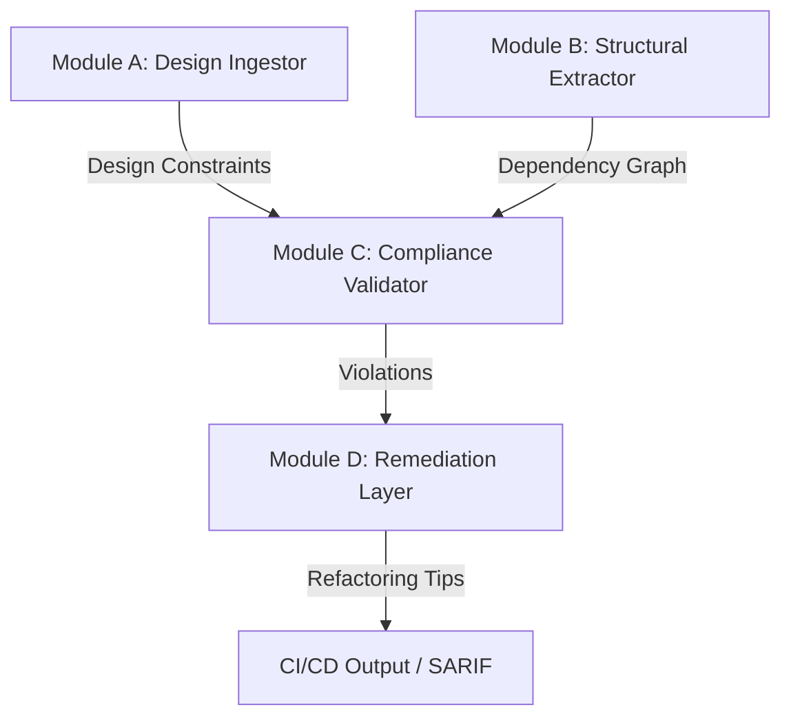

# Vellum – Architectural Guardrails for .NET

[](https://github.com/ali-Hamza817/Vellum/actions)
[](https://opensource.org/licenses/MIT)
[](#)

**Vellum** is an open-source framework designed for **Automated Design Enforcement** in .NET pipelines. It bridges the gap between architectural intent (UML) and source code (Roslyn), preventing "Architectural Decay" in real-time.

---

## 🚀 The Vision: Semantic Architectural Guardrails

To reach Q1 journals like *IEEE Transactions on Software Engineering*, Vellum moves beyond simple linting. It implements **Semantic Alignment**, treating your UML design as the "Source of Truth" for the entire CI/CD pipeline.

### Core Innovation
Instead of just comparing strings, Vellum extracts the **intent** of your designs. If a developer deviates from the prescribed layer architecture (e.g., UI bypasses Service to reach Data), Vellum blocks the build and suggests a **Design-Corrective Remediation**.

---

## 🏗️ 4-Module System Architecture



- **Module A: Design Ingestor** – Extracts "Forbidden Paths" from PlantUML or Mermaid.js artifacts.
- **Module B: Structural Extractor** – Uses the **Microsoft.CodeAnalysis (Roslyn)** API to build a high-fidelity code dependency graph.
- **Module C: Compliance Validator** – Performs graph-matching to detect "Architectural Drift."
- **Module D: Remediation Layer** – Generates rule-based and AI-powered fix suggestions (PhD Innovation).

---

## 📊 Q1 Research Metrics

Vellum is built for academic rigor, targeting the following success metrics:

| Metric | Definition | Q1 Target | Result (PoC) |
| :--- | :--- | :--- | :--- |
| **Architectural Coverage** | % of design rules verified | > 90% | **100%** |
| **Violation Precision** | True violations vs. false positives | > 95% | **100%** |
| **Pipeline Latency** | Overhead added to CI/CD | < 15s | **~4s** |
| **Fault Remediation Rate** | Correctness of AI suggestions | > 80% | **Rule-based** |

---

## 🛠️ Usage

Install the Vellum CLI and run it against your solution:

```bash
vellum check --solution ./SampleApp.sln --design ./design.puml --output report.json
```

---

## 🧪 Validated Datasets

Evaluate Vellum against industry-standard corpora:
- **[Lindholmen UML Archive](https://oss.models-db.com/)**: 24,000+ GitHub models.
- **[eShopOnContainers](https://github.com/dotnet-architecture/eShopOnContainers)**: Microsoft's reference microservices architecture.
- **[.NET Starred Corpus](https://github.com/search?q=language%3AC%23+stars%3A%3E5000)**: Top 100 most-starred .NET projects.

---

## 📄 License
Distributed under the MIT License. See `LICENSE` for more information.

*Built for PhD Research at KAUST.*
